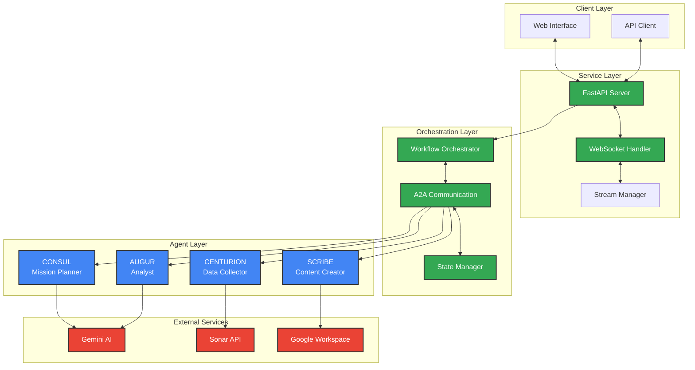
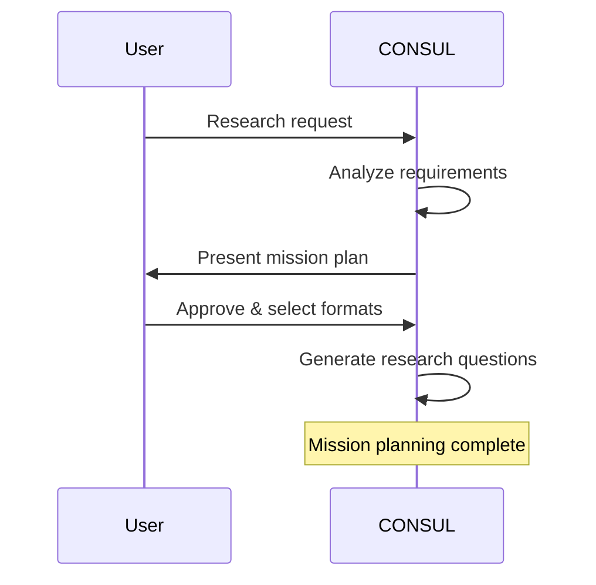
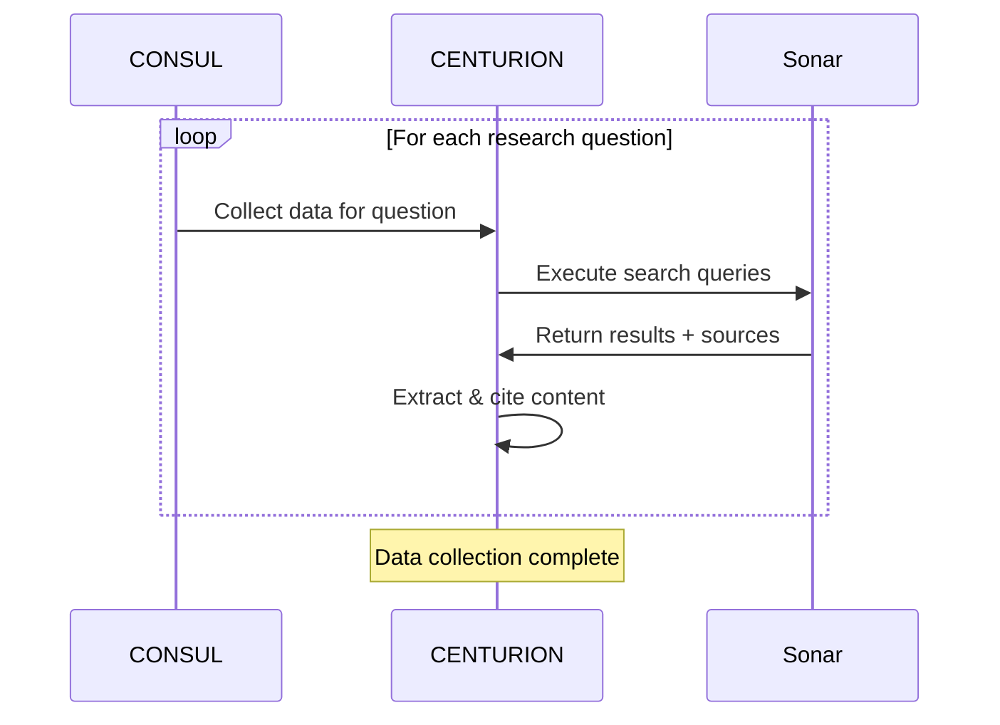
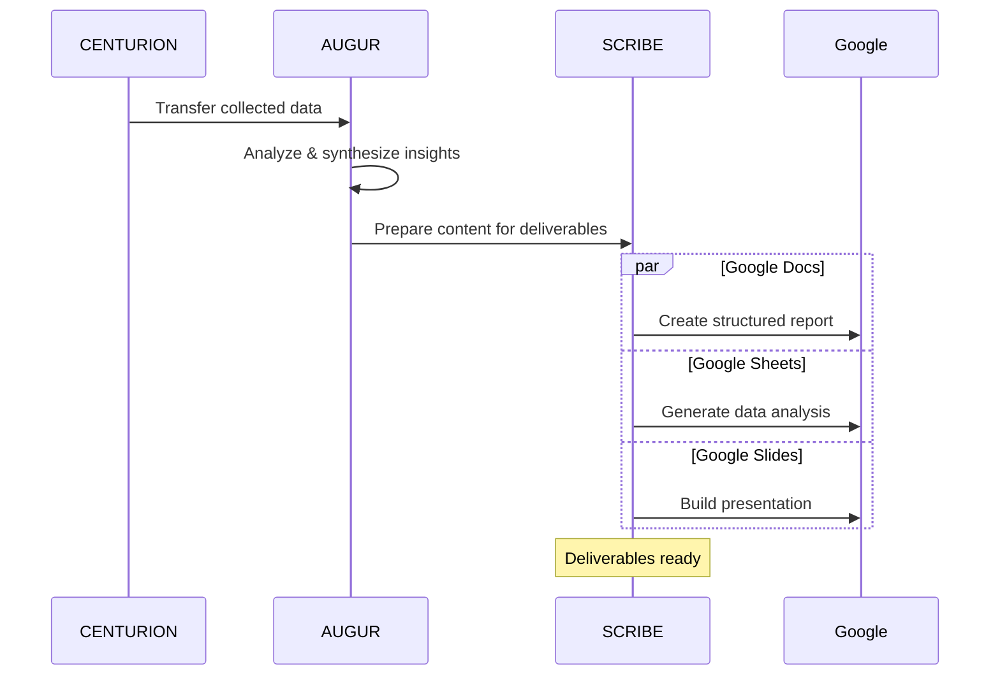

# Legion ADK System

<div align="center">
  


[](https://cloud.google.com)
[](https://deepmind.google/technologies/gemini/)
[](https://python.org)
[](https://fastapi.tiangolo.com)
[](LICENSE)

**AI-Powered Research Automation Platform**

*Legion orchestrates specialized AI agents to conduct comprehensive research, analysis, and deliverable creation autonomously.*

</div>

---

## Table of Contents

<div align="center">
<table>
<tr>
<td><a href="#overview">Overview</a></td>
<td><a href="#features">Features</a></td>
<td><a href="#architecture">Architecture</a></td>
<td><a href="#agents">Agents</a></td>
</tr>
<tr>
<td><a href="#installation">Installation</a></td>
<td><a href="#configuration">Configuration</a></td>
<td><a href="#quick-start">Quick Start</a></td>
<td><a href="#api-reference">API Reference</a></td>
</tr>
</table>
</div>

---

## Overview

Legion is an advanced AI research platform built on Google's ADK paradigm. It functions as an autonomous research employee, orchestrating multiple specialized AI agents to handle complete research workflows from planning to professional deliverable creation.

### Core Value Proposition

- **Autonomous Operations** - Complete research projects independently without supervision
- **Direct Integration** - Creates professional Google Docs, Sheets, and Slides in your workspace
- **Citation Management** - Every insight backed by properly formatted citations
- **Systematic Approach** - Question-driven methodology for comprehensive exploration
- **Real-Time Monitoring** - Live progress tracking and agent communication logs

### Business Impact

| Metric | Traditional Research | Legion ADK |
|--------|---------------------|------------|
| Research Speed | Days to weeks | Minutes to hours |
| Output Quality | Manual formatting | Professional deliverables |
| Source Tracking | Manual citations | Automated citation management |
| Scalability | Linear with team size | Parallel processing |

---

## Features

### Agent Orchestration
- Four specialized AI agents with distinct roles
- Agent-to-Agent (A2A) communication protocol
- Intelligent task delegation and error recovery
- Real-time collaboration monitoring

### Deliverable Creation
- **Google Docs** - Comprehensive reports with structured sections
- **Google Sheets** - Data analysis with visualizations and multiple worksheets  
- **Google Slides** - Executive presentations with speaker notes

### Research Capabilities
- Multi-source web research via Sonar API
- Academic and industry source prioritization
- Real-time content extraction and analysis
- Question-driven exploration methodology

### Enterprise Features
- Google Cloud native integration
- Secure API key management
- WebSocket streaming for live updates
- Comprehensive error handling and recovery

---

## Architecture



---

## Agents

### CONSUL - Strategic Mission Planner
**Role:** Mission planning and orchestration  
**Capabilities:**
- Conversational mission planning with users
- Research question generation and prioritization
- Format selection guidance and requirements gathering
- Workflow coordination and agent task delegation

### CENTURION - Data Collection Specialist  
**Role:** Web research and source gathering  
**Capabilities:**
- Multi-source web research via Sonar API
- Content extraction with automatic citation capture
- Source credibility assessment and filtering
- Parallel data collection with error resilience

### AUGUR - Analysis Expert
**Role:** Data synthesis and insight generation  
**Capabilities:**
- Cross-source data analysis and pattern recognition
- Insight generation with supporting evidence
- Citation integration and reference management
- Format-specific content preparation

### SCRIBE - Content Creation Master
**Role:** Professional deliverable creation  
**Capabilities:**
- Google Docs report generation with structured sections
- Google Sheets creation with data visualization
- Google Slides presentation development
- Multi-format deliverable synchronization

---

## Installation

### Prerequisites
- Python 3.11+
- Google Cloud Project with enabled APIs
- Gemini API key
- Sonar API key

### Setup Process

**1. Clone Repository**
```bash
git clone https://github.com/victorbash400/legion-adk.git
cd legion-adk
```

**2. Environment Setup**
```bash
python -m venv venv
source venv/bin/activate  # Windows: venv\Scripts\activate
pip install -r requirements.txt
```

**3. Google Cloud Configuration**
```bash
export GOOGLE_APPLICATION_CREDENTIALS="path/to/service-account-key.json"
```

**4. Required Google APIs**
Enable the following in Google Cloud Console:
- Google Docs API
- Google Sheets API  
- Google Slides API
- Google Drive API

---

## Configuration

### Environment Variables

Create `.env` file in project root:

```env
# API Configuration
GEMINI_API_KEY=your_gemini_api_key_here
SONAR_API_KEY=your_sonar_api_key_here

# Google Cloud Setup
GOOGLE_CLOUD_PROJECT=your-project-id
GOOGLE_APPLICATION_CREDENTIALS=path/to/service-account.json

# Server Configuration
PORT=8000
HOST=0.0.0.0

# Optional Features
USE_FIRESTORE=false
FIRESTORE_DATABASE=(default)
```

### Service Account Permissions

Required OAuth 2.0 scopes:
```python
SCOPES = [
    'https://www.googleapis.com/auth/documents',
    'https://www.googleapis.com/auth/spreadsheets', 
    'https://www.googleapis.com/auth/presentations',
    'https://www.googleapis.com/auth/drive.file'
]
```

---

## Quick Start

### Launch Legion Server

```bash
python main.py
```

Access web interface: `http://localhost:8000`

### API Usage

**Start Research Mission**
```python
import requests

# Create new chat session
response = requests.post("http://localhost:8000/api/chats", 
    json={"message": "Research AI applications in healthcare diagnostics"})
chat_id = response.json()["id"]

# Continue conversation with CONSUL
requests.post(f"http://localhost:8000/api/chats/{chat_id}/messages",
    json={"content": "Focus on imaging and radiology applications"})
```

**Monitor Progress**
```javascript
// WebSocket connection for real-time updates
const ws = new WebSocket(`ws://localhost:8000/ws/${chatId}`);

ws.onmessage = (event) => {
    const data = JSON.parse(event.data);
    console.log(`[${data.agent}] ${data.message}`);
};
```

---

## Workflow Process

### Phase 1: Mission Planning


### Phase 2: Data Collection


### Phase 3: Analysis & Creation


---

## API Reference

### Core Endpoints

| Method | Endpoint | Description |
|--------|----------|-------------|
| `POST` | `/api/chats` | Create new research mission |
| `POST` | `/api/chats/{id}/messages` | Continue conversation |
| `GET` | `/api/research/{id}/status` | Get mission status |
| `GET` | `/api/research/{id}/deliverables` | Retrieve outputs |

### Request/Response Examples

**Create Mission**
```json
POST /api/chats
{
  "message": "Analyze competitive landscape of cloud storage providers"
}

Response:
{
  "id": "chat_123",
  "status": "active",
  "created": "2024-01-15T10:30:00Z"
}
```

**Mission Status**
```json
GET /api/research/chat_123/status

Response:
{
  "status": "active",
  "phase": "analyzing", 
  "progress": 75,
  "agents_active": ["AUGUR", "SCRIBE"],
  "questions_completed": 6,
  "questions_total": 8
}
```

### WebSocket Events

**Agent Communication**
```json
{
  "event": "agent_conversation",
  "from_agent": "CONSUL",
  "to_agent": "CENTURION", 
  "message": "Collect data for market sizing question",
  "timestamp": "2024-01-15T10:35:00Z"
}
```

**Operation Progress**
```json
{
  "event": "agent_operation",
  "agent": "SCRIBE",
  "operation": "creating_google_doc",
  "progress": 45,
  "details": "Adding citations and references"
}
```

---

## Development

### Project Structure

```
legion-adk/
├── agents/
│   ├── base_adk_agent.py      # Base agent class
│   ├── adk_consul.py          # Mission planner
│   ├── adk_centurion.py       # Data collector  
│   ├── adk_augur.py           # Analyst
│   └── adk_scribe.py          # Content creator
├── services/
│   ├── adk_communication.py    # A2A protocol
│   ├── state_manager.py        # State synchronization
│   └── stream_manager.py       # Real-time updates
├── orchestration/
│   └── adk_workflow.py         # Workflow orchestrator
├── api/
│   ├── routes/                 # API endpoints
│   └── websocket.py           # WebSocket handlers
└── main.py                    # Application entry
```

### Custom Agent Development

```python
from agents.base_adk_agent import BaseADKAgent

class CustomAgent(BaseADKAgent):
    def __init__(self, state_manager, api_key=None):
        super().__init__("custom_agent", state_manager, api_key)
    
    def _get_agent_personality(self) -> str:
        return "specialized expert in domain X"
    
    async def _execute_agent_task(self, task: A2ATask) -> Dict[str, Any]:
        # Implement custom task execution logic
        return {"status": "completed", "result": result}
```

### Testing & Quality

```bash
# Install development dependencies
pip install -r requirements-dev.txt

# Run test suite
pytest tests/ -v

# Code formatting
black agents/ services/ orchestration/

# Type checking  
mypy agents/ services/
```

---

## Google Cloud Integration

### Authentication Setup

```python
from google.oauth2 import service_account

credentials = service_account.Credentials.from_service_account_file(
    'service-account-key.json',
    scopes=SCOPES
)
```

### Document Creation Pipeline

```python
# SCRIBE creates deliverables directly in Google Workspace
docs_service = build('docs', 'v1', credentials=credentials)
sheets_service = build('sheets', 'v4', credentials=credentials) 
slides_service = build('slides', 'v1', credentials=credentials)

# Batch operations for efficiency
batch = docs_service.new_batch_http_request()
batch.add(docs_service.documents().create(body=doc_body))
batch.add(sheets_service.spreadsheets().create(body=sheet_body))
batch.execute()
```

---

## Troubleshooting

### Common Issues

**API Rate Limits**
```python
# Implement exponential backoff
async def api_call_with_retry(func, *args, max_retries=3):
    for attempt in range(max_retries):
        try:
            return await func(*args)
        except RateLimitError:
            await asyncio.sleep(2 ** attempt)
    raise Exception("Max retries exceeded")
```

**Google API Quotas**
```bash
# Monitor quota usage
gcloud compute project-info describe --project=YOUR_PROJECT
```

**Agent Communication Failures**
```python
# Enable debug logging
import logging
logging.getLogger("adk_communication").setLevel(logging.DEBUG)
```

### Performance Optimization

**Parallel Processing**
```python
# Process research questions concurrently
async def collect_all_data(questions):
    tasks = [centurion.collect_data(q) for q in questions]
    return await asyncio.gather(*tasks)
```

**Caching Strategy**
```python
# Implement Redis for repeated queries
import redis
cache = redis.Redis(host='localhost', port=6379, decode_responses=True)

def cached_search(query):
    cached_result = cache.get(f"search:{query}")
    if cached_result:
        return json.loads(cached_result)
    # Perform search and cache result
```

---

## Contributing

### Development Workflow

1. Fork repository: `https://github.com/victorbash400/legion-adk`
2. Create feature branch: `git checkout -b feature/enhancement-name`
3. Implement changes with tests
4. Ensure code quality: `black`, `mypy`, `pytest`
5. Submit pull request with detailed description

### Contribution Guidelines

- Follow existing code style and patterns
- Add comprehensive tests for new features
- Update documentation for API changes
- Include type hints for all functions
- Ensure backward compatibility

---

<div align="center">

**Legion ADK System**  
*AI-Powered Research Automation*

Built with Python • FastAPI • Google Cloud • Gemini AI

[GitHub](https://github.com/victorbash400/legion-adk) • [Documentation](https://github.com/victorbash400/legion-adk/wiki) • [Issues](https://github.com/victorbash400/legion-adk/issues)

</div>
