# 🏛️ Legion ADK System

<div align="center">
  
  
  
  [](https://cloud.google.com)
  [](https://deepmind.google/technologies/gemini/)
  [](https://python.org)
  [](https://fastapi.tiangolo.com)
  [](LICENSE)
  
  **Your AI-Powered Research Employee That Never Sleeps** 🤖
  
  *Legion orchestrates a team of specialized AI agents to conduct comprehensive research, analysis, and deliverable creation—all while you focus on what matters.*
  
</div>

---

## 📋 Table of Contents

- [🌟 Overview](#-overview)
- [🚀 Key Features](#-key-features)
- [🏗️ Architecture](#️-architecture)
- [🤖 The Agent Team](#-the-agent-team)
- [🔧 Installation](#-installation)
- [⚙️ Configuration](#️-configuration)
- [🎯 Quick Start](#-quick-start)
- [📖 Usage Examples](#-usage-examples)
- [🔄 Workflow Deep Dive](#-workflow-deep-dive)
- [🛠️ Development](#️-development)
- [📊 API Reference](#-api-reference)
- [🔌 Google Cloud Integration](#-google-cloud-integration)
- [🚨 Troubleshooting](#-troubleshooting)
- [🤝 Contributing](#-contributing)

---

## 🌟 Overview

**Legion** is an advanced AI-powered research automation platform that functions like a highly skilled research employee. Built on Google's ADK (Accessory Development Kit) paradigm, Legion orchestrates multiple specialized AI agents to handle end-to-end research workflows—from strategic planning to professional deliverable creation.

### 🎯 What Makes Legion Special?

- **Autonomous Research Employee**: Legion doesn't just assist—it completes entire research projects independently
- **Direct Google Workspace Integration**: Creates polished Google Docs, Sheets, and Slides directly in your account
- **Citation-Aware**: Every insight is backed by properly formatted citations and sources
- **Question-Driven Intelligence**: Decomposes complex research into answerable questions for systematic exploration
- **Real-Time Collaboration**: Watch your AI team work in real-time through streaming updates

### 💼 Business Value

- **10x Research Speed**: Complete comprehensive research in minutes, not days
- **Professional Output**: Deliverables ready for executive presentations or client meetings
- **Traceable Insights**: Every conclusion linked to its source with proper citations
- **Scalable Intelligence**: Handle multiple research projects simultaneously

---

## 🚀 Key Features

### 🧠 **Intelligent Agent Orchestra**
- Four specialized AI agents working in perfect harmony
- Agent-to-Agent (A2A) conversational protocol for seamless collaboration
- Intelligent task delegation and error recovery

### 📊 **Direct Deliverable Creation**
- **Google Docs**: Comprehensive reports with citations and structured sections
- **Google Sheets**: Data analysis with multiple worksheets and visualizations
- **Google Slides**: Executive presentations with speaker notes and visual insights

### 🔍 **Advanced Research Capabilities**
- Multi-source web research via Sonar API
- Academic and industry source prioritization
- Real-time content extraction and analysis
- Automatic citation management

### 🎯 **Question-Driven Methodology**
- Automatic research question generation
- Prioritized question exploration
- Systematic data collection per question
- Comprehensive synthesis across all findings

### 📡 **Real-Time Operations**
- WebSocket streaming for live updates
- Progress tracking for each agent operation
- Conversational logs between agents
- Interactive mission planning

### 🔐 **Enterprise-Ready**
- Google Cloud integration
- Secure API key management
- Scalable architecture
- Comprehensive error handling

---

## 🏗️ Architecture


---

## 🤖 The Agent Team

### 🎯 **CONSUL** - Strategic Mission Planner
```python
Role: Mission planning, question generation, and orchestration
Personality: Strategic thinker and conversation coordinator
Capabilities:
  - Conversational mission planning
  - Research question generation (5-8 per mission)
  - Intelligent clarification handling
  - Format selection guidance
  - Workflow coordination
```

### 🔍 **CENTURION** - Data Collection Specialist
```python
Role: Web research and source gathering
Personality: Focused search specialist
Capabilities:
  - Multi-source web research via Sonar API
  - Content extraction with citations
  - Source credibility assessment
  - Parallel data collection
  - Error-resilient searching
```

### 🧠 **AUGUR** - Analysis & Insight Expert
```python
Role: Data analysis and content generation
Personality: Analytical specialist
Capabilities:
  - Multi-question data synthesis
  - Pattern recognition
  - Insight generation
  - Citation integration
  - Format-specific content preparation
```

### 📝 **SCRIBE** - Content Creation Master
```python
Role: Professional deliverable creation
Personality: Meticulous document craftsman
Capabilities:
  - Google Docs report generation
  - Google Sheets data visualization
  - Google Slides presentation creation
  - Citation formatting
  - Multi-format synchronization
```

---

## 🔧 Installation

### Prerequisites
- Python 3.11 or higher
- Google Cloud Project with enabled APIs
- Valid API keys for Gemini and Sonar

### Step 1: Clone the Repository
```bash
git clone https://github.com/your-org/legion-adk.git
cd legion-adk
```

### Step 2: Create Virtual Environment
```bash
python -m venv venv
source venv/bin/activate  # On Windows: venv\Scripts\activate
```

### Step 3: Install Dependencies
```bash
pip install -r requirements.txt
```

### Step 4: Set Up Google Cloud Credentials
```bash
# Download your service account key
export GOOGLE_APPLICATION_CREDENTIALS="path/to/your/service-account-key.json"
```

---

## ⚙️ Configuration

### Environment Variables
Create a `.env` file in the project root:

```env
# API Keys
GEMINI_API_KEY=your_gemini_api_key_here
SONAR_API_KEY=your_sonar_api_key_here

# Google Cloud Configuration
GOOGLE_CLOUD_PROJECT=your-project-id
GOOGLE_APPLICATION_CREDENTIALS=path/to/service-account.json

# Optional: Database Configuration
USE_FIRESTORE=false
FIRESTORE_DATABASE=(default)

# Server Configuration
PORT=8000
HOST=0.0.0.0
```

### Google Workspace Setup
1. Enable the following APIs in Google Cloud Console:
   - Google Docs API
   - Google Sheets API
   - Google Slides API
   - Google Drive API

2. Configure OAuth 2.0 or Service Account:
   ```python
   # For service account (recommended for automation)
   SCOPES = [
       'https://www.googleapis.com/auth/documents',
       'https://www.googleapis.com/auth/spreadsheets',
       'https://www.googleapis.com/auth/presentations',
       'https://www.googleapis.com/auth/drive.file'
   ]
   ```

---

## 🎯 Quick Start

### 1. Start the Legion Server
```bash
python main.py
```

### 2. Access the Web Interface
```
http://localhost:8000
```

### 3. Start Your First Mission
```python
# Via API
import requests

response = requests.post("http://localhost:8000/api/chats", 
    json={"message": "Research the impact of AI on healthcare"})
chat_id = response.json()["id"]

# Continue conversation
requests.post(f"http://localhost:8000/api/chats/{chat_id}/messages",
    json={"content": "Focus on diagnostic applications"})
```

### 4. Monitor Progress in Real-Time
```javascript
// WebSocket connection for live updates
const ws = new WebSocket(`ws://localhost:8000/ws/${chatId}`);

ws.onmessage = (event) => {
    const data = JSON.parse(event.data);
    console.log(`${data.agent}: ${data.message}`);
};
```

---

## 📖 Usage Examples

### Example 1: Market Research Mission
```python
# Start a market research mission
message = """
I need a comprehensive market analysis of the electric vehicle 
charging infrastructure industry. Include key players, market size, 
growth projections, and technological trends.
"""

# Legion will:
# 1. Generate 6-8 research questions
# 2. Collect data for each question
# 3. Analyze findings
# 4. Create Google Docs report + Sheets with data
```

### Example 2: Competitive Analysis
```python
# Request competitive analysis
message = """
Analyze the competitive landscape of cloud storage providers. 
Compare features, pricing, market share, and customer satisfaction.
Create a presentation for our executive team.
"""

# Legion delivers:
# - Executive presentation (Google Slides)
# - Detailed comparison spreadsheet
# - Comprehensive report with citations
```

### Example 3: Technology Assessment
```python
# Technology research request
message = """
Research quantum computing applications in cryptography. 
What are the current capabilities, limitations, and timeline 
for practical implementation?
"""

# Output includes:
# - Technical report with academic citations
# - Timeline visualization in Sheets
# - Executive summary presentation
```

---

## 🔄 Workflow Deep Dive

### Phase 1: Mission Planning (CONSUL)


### Phase 2: Data Collection (CENTURION)


### Phase 3: Analysis (AUGUR)


### Phase 4: Deliverable Creation (SCRIBE)

```mermaid
sequenceDiagram
    participant AUGUR
    participant SCRIBE
    participant Google APIs
    
    AUGUR->>SCRIBE: Formatted content
    
    alt Google Docs
        SCRIBE->>Google APIs: Create document
        SCRIBE->>Google APIs: Add sections + citations
    else Google Sheets
        SCRIBE->>Google APIs: Create spreadsheet
        SCRIBE->>Google APIs: Add data + charts
    else Google Slides
        SCRIBE->>Google APIs: Create presentation
        SCRIBE->>Google APIs: Add slides + notes
    end
    
    SCRIBE->>User: Deliverables ready! 🎉
```


---

## 🛠️ Development

### Project Structure
```
legion-adk/
├── agents/
│   ├── base_adk_agent.py      # Base agent class
│   ├── adk_consul.py          # CONSUL implementation
│   ├── adk_centurion.py       # CENTURION implementation
│   ├── adk_augur.py           # AUGUR implementation
│   └── adk_scribe.py          # SCRIBE implementation
├── services/
│   ├── adk_communication.py    # A2A protocol
│   ├── state_manager.py        # State synchronization
│   ├── storage_manager.py      # Data persistence
│   └── stream_manager.py       # Real-time updates
├── orchestration/
│   └── adk_workflow.py         # Workflow orchestrator
├── api/
│   ├── routes/                 # API endpoints
│   └── websocket.py           # WebSocket handlers
├── tools/
│   └── web_research.py        # Research utilities
├── main.py                    # Application entry point
└── requirements.txt           # Dependencies
```

### Adding a New Agent
```python
from agents.base_adk_agent import BaseADKAgent

class CustomAgent(BaseADKAgent):
    def __init__(self, state_manager, api_key=None):
        super().__init__("custom", state_manager, api_key)
    
    def _get_agent_personality(self) -> str:
        return "a specialized expert in X"
    
    async def _execute_agent_task(self, task: A2ATask) -> Dict[str, Any]:
        # Implement task execution
        pass
```

### Extending the A2A Protocol
```python
# Custom task type
task = A2ATask(
    task_id=generate_id(),
    from_agent="consul",
    to_agent="custom",
    task_type="custom_analysis",
    parameters={"data": data},
    chat_id=chat_id
)

# Custom response
response = A2AResponse(
    task_id=task.task_id,
    status="completed",
    response_data={"insights": insights},
    artifacts=[{"type": "custom", "data": data}]
)
```

---

## 📊 API Reference

### Core Endpoints

#### POST `/api/chats`
Create a new research mission
```json
{
  "message": "Research topic or question"
}
```

#### POST `/api/chats/{chat_id}/messages`
Continue conversation with CONSUL
```json
{
  "content": "Additional requirements or approval"
}
```

#### GET `/api/research/{chat_id}/status`
Get current mission status
```json
{
  "status": "active|completed",
  "phase": "planning|collecting|analyzing|creating",
  "progress": 75,
  "agents_active": ["CENTURION", "AUGUR"]
}
```

#### GET `/api/research/{chat_id}/deliverables`
Retrieve generated deliverables
```json
{
  "deliverables": [
    {
      "title": "Market Analysis Report",
      "url": "https://docs.google.com/document/d/...",
      "type": "google_doc",
      "created": "2024-01-15T10:30:00Z"
    }
  ]
}
```

### Streaming Endpoints

#### WebSocket `/ws/{chat_id}`
Real-time mission updates
```javascript
// Message types
{
  "event": "agent_conversation",
  "from_agent": "CONSUL",
  "to_agent": "CENTURION",
  "message": "Collect data for question 1"
}

{
  "event": "agent_operation",
  "agent": "AUGUR",
  "operation_type": "analyzing",
  "progress": 45
}
```

#### SSE `/api/research/{chat_id}/operations/stream`
Server-sent events for operation updates

---

## 🔌 Google Cloud Integration

### Service Account Setup
```python
from google.oauth2 import service_account

credentials = service_account.Credentials.from_service_account_file(
    'path/to/service-account-key.json',
    scopes=SCOPES
)
```

### Direct Document Creation
```python
# SCRIBE creates documents directly in your Google Drive
doc = docs_service.documents().create(body={
    'title': 'AI Healthcare Impact Analysis'
}).execute()

# With proper folder organization
drive_service.files().update(
    fileId=doc['documentId'],
    addParents=folder_id,
    fields='id, parents'
).execute()
```

### Batch Operations
```python
# SCRIBE can create multiple deliverables efficiently
batch = docs_service.new_batch_http_request()
batch.add(docs_service.documents().create(...))
batch.add(sheets_service.spreadsheets().create(...))
batch.add(slides_service.presentations().create(...))
batch.execute()
```

---

## 🚨 Troubleshooting

### Common Issues

#### 1. Sonar API Rate Limits
```python
# Solution: Implement exponential backoff
async def search_with_retry(query, max_retries=3):
    for attempt in range(max_retries):
        try:
            return await sonar_search(query)
        except RateLimitError:
            await asyncio.sleep(2 ** attempt)
```

#### 2. Google API Quotas
```bash
# Monitor quota usage
gcloud compute project-info describe --project=YOUR_PROJECT
```

#### 3. Agent Communication Failures
```python
# Enable debug logging
import logging
logging.getLogger("adk_communication").setLevel(logging.DEBUG)
```

### Performance Optimization

#### Parallel Question Processing
```python
# Process multiple questions concurrently
tasks = [collect_data(q) for q in questions]
results = await asyncio.gather(*tasks)
```

#### Caching Strategy
```python
# Implement Redis caching for repeated queries
import redis
cache = redis.Redis(host='localhost', port=6379)
```

---

## 🤝 Contributing

We welcome contributions! Please see our [Contributing Guidelines](CONTRIBUTING.md).

### Development Setup
```bash
# Install development dependencies
pip install -r requirements-dev.txt

# Run tests
pytest tests/

# Code formatting
black agents/ services/ orchestration/

# Type checking
mypy agents/ services/
```

### Pull Request Process
1. Fork the repository
2. Create a feature branch (`git checkout -b feature/amazing-feature`)
3. Commit your changes (`git commit -m 'Add amazing feature'`)
4. Push to the branch (`git push origin feature/amazing-feature`)
5. Open a Pull Request

---

## 📄 License

This project is licensed under the MIT License - see the [LICENSE](LICENSE) file for details.

---

## 🙏 Acknowledgments

- Google Cloud team for the ADK framework inspiration
- OpenAI for advancing conversational AI
- The open-source community for invaluable tools and libraries

---

<div align="center">
  
  **Built with ❤️ by the Legion Team**
  
  [Documentation](https://legion-docs.example.com) • [Issues](https://github.com/your-org/legion/issues) • [Discussions](https://github.com/your-org/legion/discussions)
  
</div>